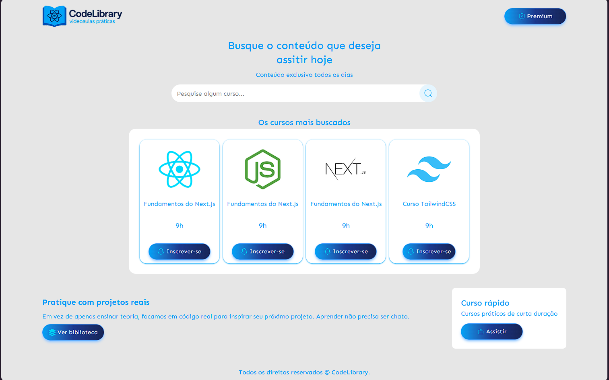

# 🚀 React + TypeScript + Vite + React Icons



🔗 [Acesse o projeto online](https://react-full-2026-livid.vercel.app)

---

## 📖 Sobre o projeto

Este projeto foi desenvolvido com **React**, **TypeScript** e **Vite**, utilizando **React Icons** para ícones.  
O objetivo é servir como base para aplicações modernas e rápidas, com tipagem forte e componentes reutilizáveis.

---

## 🛠️ Tecnologias utilizadas

- ⚛️ [React](https://react.dev/) — Biblioteca para construção de interfaces
- 🌀 [Vite](https://vitejs.dev/) — Bundler rápido e moderno
- 🔷 [TypeScript](https://www.typescriptlang.org/) — Tipagem estática para JavaScript
- 🎨 [React Icons](https://react-icons.github.io/react-icons/) — Biblioteca de ícones

---

## 📦 Instalação e uso

Clone o repositório:

```bash
git clone https://github.com/seu-usuario/react-full-2026.git
```
